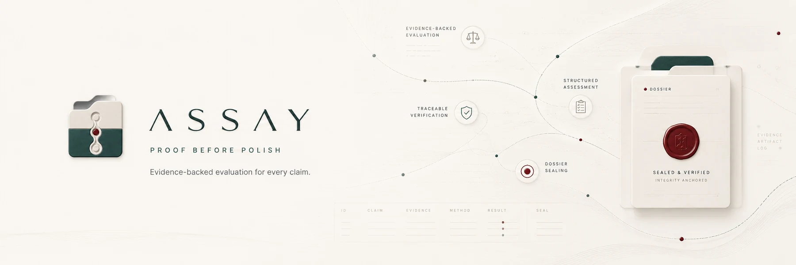
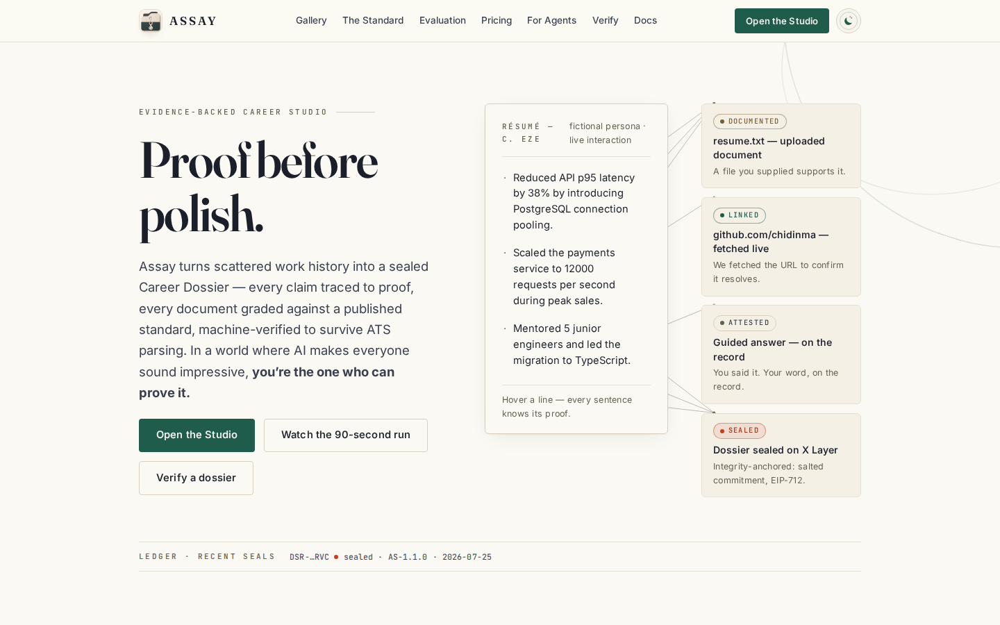
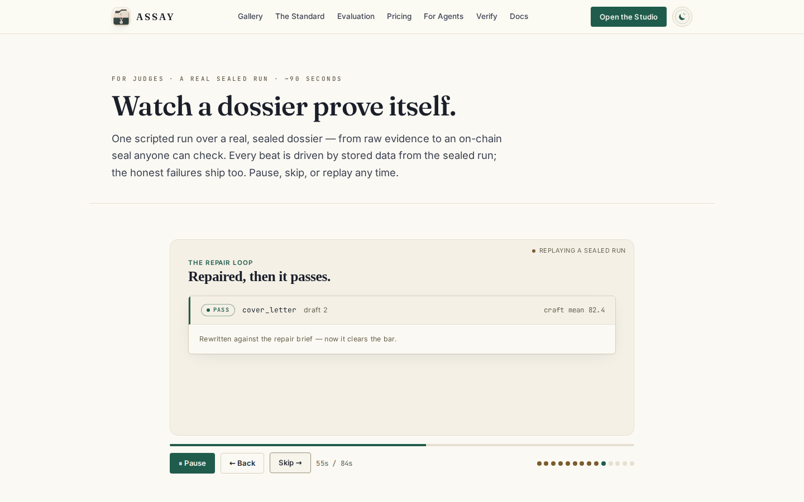
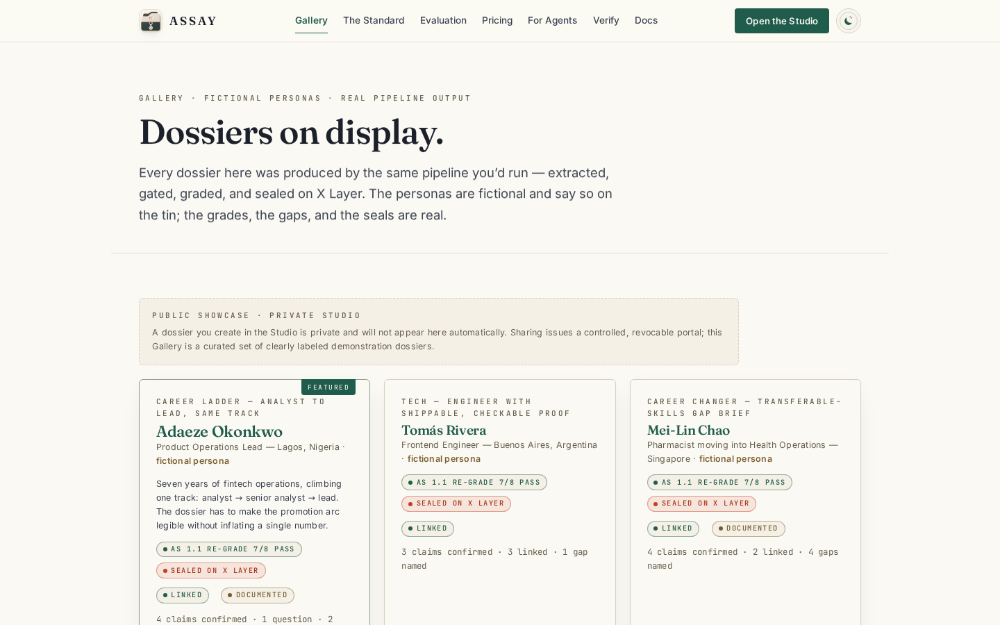
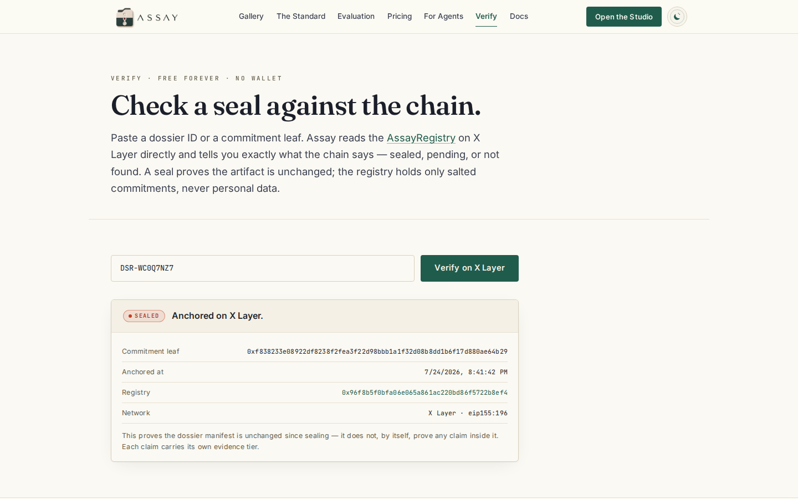
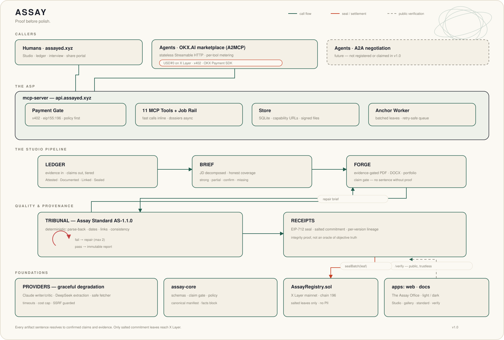

<div align="center">



# ASSAY

### _Proof before polish._

Assay turns scattered work history into an evidence-backed Career Dossier. Every sentence traces
to confirmed proof, every artifact is graded against a published standard, and GenLayer validators
independently adjudicate whether user-approved public evidence supports a professional claim. The
resulting consensus receipt enters the manifest before its privacy-preserving integrity seal on X
Layer. Assay serves people directly and remains an A2MCP service other agents can hire by the call.

[](https://assayed.xyz)
[](https://explorer-bradbury.genlayer.com/address/0xa0A37DEf61d5C621FDeF43b604D8059779D1B96E)
[](https://assayed.xyz/agents)
[](https://www.oklink.com/x-layer/address/0x96f8b5f0bfa06e065a861ac220bd86f5722b8ef4)
[](https://assayed.xyz/standard)
[](CHANGELOG.md)
[](https://github.com/Franlinozz/ASSAY/actions/workflows/ci.yml)

**[Open the Studio](https://assayed.xyz/studio)** ·
**[Watch the 90-second judged run](https://assayed.xyz/judge)** ·
**[Read the docs](https://assayed.xyz/docs)**

</div>

## The problem

AI can make every candidate sound exceptional, which makes fluent prose cheap and trust scarce.
Traditional résumé tools optimize keywords without knowing whether a claim is supported. Career
evidence is usually scattered across documents, links, memories, and systems that never reconcile.

## How it works

1. **[Evidence](https://assayed.xyz/studio)** — ingest documents, links, certificates, and guided answers into a tiered claim ledger.
2. **[Brief](https://assayed.xyz/docs/tools/asy_fit_brief)** — decompose a job, promotion, or client brief into honest strong/partial/confirm/missing coverage.
3. **[Forge](https://assayed.xyz/docs/tools/asy_create_dossier_job)** — produce evidence-gated résumés, letters, stories, review packs, proof packs, portfolios, and manifests.
4. **[Tribunal](https://assayed.xyz/standard)** — grade deterministic laws and craft, then issue a bounded repair brief instead of quietly lowering the bar.
5. **Consensus** — explicitly approve the exact public claim, criterion, and URLs; your wallet sends them directly to `AssayAdjudicator` on GenLayer Testnet Bradbury.
6. **[Seal](https://assayed.xyz/docs/verify)** — after GenLayer finality, sign the receipt-bearing canonical version and anchor only its salted commitment leaf on X Layer.
7. **[Share](https://assayed.xyz/gallery)** — expose a redacted recruiter portal, selected work samples, or a machine-readable agent hand-off.

## See the system

<table>
  <tr>
    <td width="50%"></td>
    <td width="50%"></td>
  </tr>
  <tr>
    <td align="center"><sub><b>Proof before polish</b> — every sentence exposes its evidence thread.</sub></td>
    <td align="center"><sub><b>FAIL → repair → PASS</b> — the first draft is never quietly hidden.</sub></td>
  </tr>
  <tr>
    <td width="50%"></td>
    <td width="50%"></td>
  </tr>
  <tr>
    <td align="center"><sub><b>Real pipeline exhibits</b> — fictional personas, honest grades, real seals.</sub></td>
    <td align="center"><sub><b>Public verification</b> — no wallet and no payment required.</sub></td>
  </tr>
</table>

## The trust stack

1. **GenLayer — primary adjudication.** `AssayAdjudicator` fetches bounded, approved public evidence
   inside the Intelligent Contract. Validators independently evaluate the substantive decision
   under the Equivalence Principle, and only consensus-accepted results change contract state.
2. **Assay Standard — deterministic authority.** The claim gate and Tribunal own evidence linkage,
   numeric facts, format laws, parse-back, policy, and the published AS-1.1.0 grading rules.
3. **X Layer — dossier integrity.** A finalized GenLayer reference enters the canonical manifest;
   X Layer then anchors only its salted commitment. This preserves the exact dossier version.
4. **OKX.AI — agent distribution and settlement.** The existing 12-tool A2MCP surface, 13 offers,
   fixed prices, x402 settlement, and free `asy_verify` flow remain unchanged.

GenLayer consensus means approved evidence supports—or does not support—a claim under stated
criteria. It does not prove identity, employment, issuer authenticity, or absolute factual truth.
Private career documents and PII never go to GenLayer by default.

## Four moats

### 1. The claim gate

No artifact sentence renders unless its `claimIds[]` resolve to confirmed claims backed by existing
evidence. Unsupported experience becomes a question, never polished fiction. The same rule checks
typed interview answers against the ledger, so “led 12” is flagged when the evidence says 8.

### 2. A standard that grades its maker

[AS-1.1.0](https://assayed.xyz/standard) is code, site, and documentation from one source. It
combines 15 deterministic hard checks with six craft axes and artifact-specific profiles. Failed
drafts receive at most two repair attempts; old reports stay immutable when the Standard changes.

### 3. Machine verification, not an “ATS score”

Assay renders the ATS PDF, opens the resulting bytes again, extracts the text with its deterministic
parser, and diffs 14 profile fields in the featured case. The gallery’s sealed demonstration
résumés parse back at 100%; the limitation of that statement is documented below.

### 4. Provenance with honest privacy

Every dossier version has a canonical manifest, EIP-712 receipt, Tribunal report, and separately
sealable commitment. Only `keccak256(manifestHash || salt)` reaches
[`AssayRegistry`](https://www.oklink.com/x-layer/address/0x96f8b5f0bfa06e065a861ac220bd86f5722b8ef4)
on X Layer; source documents, career prose, contact data, and salts stay off-chain.

## GenLayer live integration

Assay's `AssayAdjudicator` Intelligent Contract now implements the consensus-critical part of the
trust stack: it fetches a bounded set of approved public evidence inside GenLayer, asks
validators to independently decide whether that evidence supports a claim under a contract-owned
AS-1.1.0 criterion, and persists only the accepted adjudication. It has 17 passing direct-mode
tests and three passing hosted-Studionet consensus scenarios.

It is deployed to **GenLayer Testnet Bradbury** at
[`0xa0A…1B96E`](https://explorer-bradbury.genlayer.com/address/0xa0A37DEf61d5C621FDeF43b604D8059779D1B96E),
with persisted `SUPPORTED` and `INSUFFICIENT` public-evidence adjudications. The Studio now uses
`genlayer-js@1.1.8` for user-wallet writes, exposes the real transaction lifecycle, independently
verifies exact calldata and contract state server-side, and includes only finalized bounded receipt
fields in the later X Layer manifest. The claim gate, Tribunal, X Layer registry, and OKX.AI/x402
services remain unchanged. See
[`docs/GENLAYER.md`](docs/GENLAYER.md) and the
[`Bradbury transcript`](docs/GENLAYER-BRADBURY.md) for the architecture, deployment evidence, and
honestly recorded network-liveness failures.

## MCP tools and prices

MCP negotiation and discovery use the stateless Streamable HTTP endpoint
`https://api.assayed.xyz/mcp`. Assay also publishes concrete `/x402/<service>` resources so a
marketplace offer can return its own immediate 402 challenge. Prices are USDT-denominated per call
and settle through x402 on X Layer (`eip155:196`).

| Tool                                                                              | What it does                                                                |            Price |
| --------------------------------------------------------------------------------- | --------------------------------------------------------------------------- | ---------------: |
| [`asy_ats_scan`](https://assayed.xyz/docs/tools/asy_ats_scan)                     | Re-parse a résumé, flag format-law failures, and report JD keyword presence |        0.05 USDT |
| [`asy_claim_audit`](https://assayed.xyz/docs/tools/asy_claim_audit)               | Classify supported, vague, and unsupported-number claims                    |        0.05 USDT |
| [`asy_fit_brief`](https://assayed.xyz/docs/tools/asy_fit_brief)                   | Map brief requirements to confirmed evidence and visible gaps               |        0.10 USDT |
| [`asy_cover_letter`](https://assayed.xyz/docs/tools/asy_cover_letter)             | Draft a target-specific, evidence-cited letter                              |        0.15 USDT |
| [`asy_story_bank`](https://assayed.xyz/docs/tools/asy_story_bank)                 | Build Tribunal-graded STAR stories from confirmed claims                    |        0.20 USDT |
| [`asy_interview_prep`](https://assayed.xyz/docs/tools/asy_interview_prep)         | Generate questions and grade typed answers against STAR and the ledger      |        0.20 USDT |
| [`asy_tailor_resume`](https://assayed.xyz/docs/tools/asy_tailor_resume)           | Tailor achievement bullets without exceeding the evidence                   |        0.30 USDT |
| [`asy_create_dossier_job`](https://assayed.xyz/docs/tools/asy_create_dossier_job) | Run the complete job, promotion, or freelance dossier asynchronously        |        2.00 USDT |
| [`asy_job_status`](https://assayed.xyz/docs/tools/asy_job_status)                 | Poll a dossier job                                                          |             free |
| [`asy_job_result`](https://assayed.xyz/docs/tools/asy_job_result)                 | Fetch the paid job’s artifacts, reports, portfolio, and seal                |             free |
| [`asy_order_result`](https://assayed.xyz/docs/tools/asy_order_result)             | Collect a previously paid result that outlived its response window          |             free |
| [`asy_verify`](https://assayed.xyz/docs/tools/asy_verify)                         | Verify a dossier version or raw commitment leaf                             | **free forever** |

Tool names, schemas, descriptions, and prices originate in
[`toolspec.ts`](packages/mcp-server/src/toolspec.ts); the server, pricing page, generated docs, and
CI consistency gate consume that source. The MCP manifest contains **12 canonical tools**. OKX.AI
shows **13 buyer-facing offers**: recovery-only `asy_order_result` is not a new purchasable offer,
while the one `asy_create_dossier_job` tool is listed in three supported modes—Career Dossier,
Promotion Dossier, and Freelancer Proof Pack. That is one canonical API tool with three clear
entry points, not duplicated capability.

## Five-minute quickstart

Prerequisites: Node.js 22+, npm, Git, and a Chromium-compatible Linux/macOS environment. Fake mode
is deterministic and needs no provider key, wallet, or funds.

```bash
git clone https://github.com/Franlinozz/ASSAY.git
cd ASSAY
npm ci
npx playwright install chromium

export ASY_PROVIDER_MODE=fake
npm run dossier
npm run studio:dev
```

The dossier command runs extract → coverage → Forge → Tribunal → real Chromium PDF parse-back and
writes local artifacts to `packages/renderers/artifacts-out/`. When the development stack prints
its ready lines, open **http://127.0.0.1:3400/studio**. The local stack uses fake providers, a
temporary SQLite store, and the development payment gate.

### Five-minute GenLayer reproduction

The deterministic contract gate needs Python 3.12, but no wallet or network:

```bash
python3 -m venv packages/genlayer/.venv
packages/genlayer/.venv/bin/pip install -r packages/genlayer/requirements.txt
export PATH="$PWD/packages/genlayer/.venv/bin:$PATH"
npm run test:genlayer
npm run typecheck -w @xyndicate/mcp-server
npx vitest run packages/mcp-server/src/genlayer.test.ts packages/mcp-server/src/studio.test.ts
```

Then inspect the deployed [AssayAdjudicator on Testnet Bradbury](https://explorer-bradbury.genlayer.com/address/0xa0A37DEf61d5C621FDeF43b604D8059779D1B96E), its
[`SUPPORTED` transaction](https://explorer-bradbury.genlayer.com/tx/0xce27f6f78412c5cb4d4575760d2a92ad708d7d3bd8113dbd4fed5705f72f59b5),
and its [`INSUFFICIENT` transaction](https://explorer-bradbury.genlayer.com/tx/0x7456fff2aae9f82814066bcfc30f3326ef8a81180aa93d112837a88f1cdcc6be).
To exercise a new browser write, run the Studio, add a fetched public GitHub/GitLab/Assay link to a
confirmed claim, finish the Tribunal, connect a funded GenLayer wallet, review the exact public
payload, and submit from Consensus. Assay never proxies that write through its backend. Testnet GEN
has no revenue value.

## Verify it yourself

The featured fictional persona, Adaeze Okonkwo, has dossier ID `DSR-WC0Q7NZ7` and commitment leaf
`0xf838233e08922df8238f2fea3f22d98bbb1a1f32d08b8dd1b6f17d880ae64b29`. Its three-person seal
batch is visible on the
[`X Layer explorer`](https://www.oklink.com/x-layer/tx/0xae83407122efebea92e422921f91dd319ad504c611388fe15196274dc92b923e).

```bash
curl -sS https://api.assayed.xyz/mcp \
  -H 'content-type: application/json' \
  -H 'accept: application/json, text/event-stream' \
  --data-binary '{
    "jsonrpc":"2.0",
    "id":1,
    "method":"tools/call",
    "params":{
      "name":"asy_verify",
      "arguments":{"dossierId":"DSR-WC0Q7NZ7"}
    }
  }'
```

`asy_verify` is never payment-gated. You can also paste the dossier ID or leaf into the
[public verifier](https://assayed.xyz/verify).

## What the proofs do—and do not—mean

- **Parse-back proves readable round-trip through Assay’s deterministic parser and format law.** It
  is not a simulation or endorsement of Workday, Greenhouse, Lever, or every proprietary ATS, and
  it does not predict recruiter ranking.
- **A seal proves integrity, version, signer, and anchoring time.** It does not prove a career claim
  is objectively true. Attested, Documented, Linked, and Sealed evidence tiers remain visible
  because integrity and truth are different questions.
- **Linked means a URL resolved and passed the guarded fetch at evaluation time.** It is not a
  permanent authenticity guarantee for third-party content.
- **Certificate import is documented evidence, not issuer confirmation.** Independent employer,
  school, and credential verification are outside v1.
- **The gallery is fictional.** Its personas are unmistakably labeled demonstrations; their
  pipeline output, Chromium parse-back, Tribunal reports, and X Layer seals are real. The sealed
  AS-1.0 sets honestly re-grade at 7/8 under AS-1.1 because their story banks fail the newer STAR
  completeness profile.
- **A2A negotiation is not shipped.** Assay is registered and technically proven as A2MCP; its
  public listing is currently back under review after the operator-approved avatar update. It will
  not claim a negotiated-delivery agent until that training and acceptance suite exists.
- **No voice interviewer or impersonation.** Interview Room evaluates typed answers; it does not
  roleplay a person.

## Test evidence

The Assay release gate runs **446 tests**: 385 Vitest, 57 Playwright, and 4 Foundry. The GenLayer
contract job independently adds **17 direct-mode tests**, and its authorized Studionet checkpoint
adds **3 consensus tests** (466 measured across all green suites), plus GenVM lint. The gates also
typecheck every workspace,
regenerate the published Standard and 12 tool pages, prove manifest/docs/pricing consistency, and
run the repository dead-link gauntlet. See
[CI](https://github.com/Franlinozz/ASSAY/actions/workflows/ci.yml) and the
[fresh-clone transcript](docs/QUICKSTART-TRANSCRIPT.md).

## Repository guide

| Exhibit                                                          | Purpose                                                                      |
| ---------------------------------------------------------------- | ---------------------------------------------------------------------------- |
| [`AGENTS.md`](AGENTS.md)                                         | Build constitution, hard guardrails, price table, and append-only decisions  |
| [`ASSAY.md`](ASSAY.md)                                           | Product thesis and scope                                                     |
| [`FEATURES.md`](FEATURES.md)                                     | Every capability mapped to package, route, UI, and test                      |
| [`LISTING.md`](LISTING.md)                                       | Marketplace copy, service update result, and A2A decision                    |
| [`SECURITY.md`](SECURITY.md)                                     | Trust boundaries, SSRF, injection, PII, secrets, and disclosure              |
| [`CHANGELOG.md`](CHANGELOG.md)                                   | Keep-a-Changelog release history                                             |
| [`apps/docs`](apps/docs)                                         | Generated tool schemas, Standard mirror, integration notes, and case studies |
| [`docs/QUICKSTART-TRANSCRIPT.md`](docs/QUICKSTART-TRANSCRIPT.md) | Exact v1.0.0 fresh-clone execution proof                                     |
| [`docs/HARDENING-DRILLS.md`](docs/HARDENING-DRILLS.md)           | Executed failure, performance, dependency, and security drill record         |
| [`docs/GENLAYER-SUBMISSION.md`](docs/GENLAYER-SUBMISSION.md)     | GenLayer Project evidence, live transactions, demo script, and operator gate |
| [`docs/DEMO-KIT.md`](docs/DEMO-KIT.md)                           | Exact 90-second storyboard and operator capture instructions                 |
| [`docs/X-POST.md`](docs/X-POST.md)                               | Honest launch-thread copy and required real-proof media                      |
| [`SUBMISSION.md`](SUBMISSION.md)                                 | Pinned deadline, submission fields, and twelve-check verify-day runbook      |

## Architecture

The diagram belongs here as the implementation map after the product, proofs, and runnable path—not
as a wall between a cold reader and the problem Assay solves.

<p align="center">
  
</p>

## Links

[Live site](https://assayed.xyz) ·
[The Standard](https://assayed.xyz/standard) ·
[Documentation](https://assayed.xyz/docs) ·
[Marketplace exhibit](LISTING.md) ·
[Changelog](CHANGELOG.md) ·
[MIT License](LICENSE)

Built for the **OKX.AI Genesis Hackathon · Lifestyle Companion track** by
[Xyndicate](https://github.com/Franlinozz).
