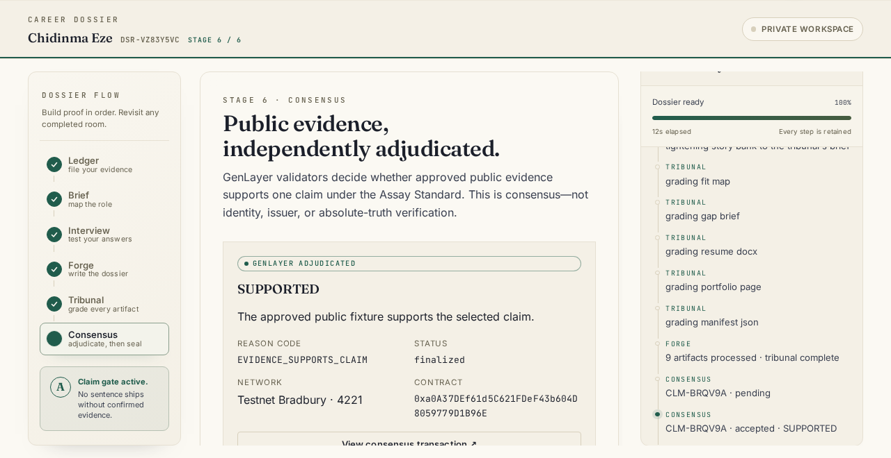

# Assay — GenLayer Project contribution pack

> Submission status: prepared, not submitted. Reviewed against the current GenLayer Portal and
> Builder-program material on 2026-08-30. The operator must connect their own Portal wallet, review
> every field, attach the final live capture/video, and submit manually.

## Paste-ready project

**Title:** Assay — Consensus-backed professional evidence

**Short description:** Assay turns professional claims into evidence-backed Career Dossiers. Its
GenLayer Intelligent Contract independently reads user-approved public evidence, applies an
explicit Assay Standard criterion, and uses validator consensus to decide whether a claim is
supported, partial, insufficient, or contradicted. The browser submits and tracks the real Testnet
Bradbury transaction lifecycle; X Layer separately seals the integrity of the finalized dossier.

**Project URL:** <https://assayed.xyz>

**Source:** <https://github.com/Franlinozz/ASSAY>

**Bradbury contract:**
[`0xa0A37DEf61d5C621FDeF43b604D8059779D1B96E`](https://explorer-bradbury.genlayer.com/address/0xa0A37DEf61d5C621FDeF43b604D8059779D1B96E)

## The trust problem

Generative AI makes polished career claims cheap. Résumé tools can optimize prose, but a recipient
still has to trust the candidate, the tool, or one centralized model to decide whether public work
evidence supports a claim. Assay already prevented unsupported sentences and graded output against
a deterministic Standard. GenLayer now owns the semantic decision that should not depend on
Assay's server alone.

The product sequence is:

```text
EVIDENCE → BRIEF → FORGE → TRIBUNAL → GENLAYER CONSENSUS → X LAYER SEAL → SHARE
```

GenLayer validators independently adjudicate whether approved public evidence supports a
professional claim under the Assay Standard. This is not identity, employer, issuer, or absolute
truth verification.

## Why GenLayer is central

A normal smart contract cannot fetch a GitHub repository, portfolio, or project page and interpret
whether its unstructured content supports a professional claim. A centralized LLM can, but leaves
the decision under one operator's control. `AssayAdjudicator` performs the fetch and LLM judgment
inside GenLayer. Validators independently fetch and evaluate the same evidence, compare stable
decision fields, and only consensus-accepted execution changes contract state.

Assay does not compute a verdict and ask GenLayer to store it. If the network times out or validators
reject the result, no adjudication exists and the X Layer seal stays locked.

## Intelligent Contract evidence

- Source: [`packages/genlayer/contracts/assay_adjudicator.py`](../packages/genlayer/contracts/assay_adjudicator.py)
- Contract documentation: [`docs/GENLAYER.md`](GENLAYER.md)
- Deployment transcript: [`docs/GENLAYER-BRADBURY.md`](GENLAYER-BRADBURY.md)
- Network: GenLayer Testnet Bradbury, chain ID `4221`
- Deployment transaction:
  [`0x495473…85ba`](https://explorer-bradbury.genlayer.com/tx/0x49547349ddc6ef6c49bd822b55f43d3da647915cefcc5e20f8ab7363382b85ba)
- Deployed source SHA-256:
  `3cbe85049363c90d21d28a139aa0fbbe933577c139f8635f40615e8c1efd11d9`

The write is bounded to a claim key, sanitized claim text, one contract-owned criterion, the exact
supported Standard version, and one to three allowlisted public HTTPS URLs. The contract fetches
those URLs through GenLayer web access, frames their contents as untrusted data, asks for
schema-constrained JSON, independently re-runs the substantive judgment in validators, and stores
only an accepted structured record.

## Equivalence Principle

The leader returns `verdict`, deterministic `reasonCode`, `sourceCount`, `unavailableCount`, and a
bounded `shortReason`. Each validator independently calls the same internal evidence-fetch and
judgment function. Consensus compares verdict, reason code, and source availability exactly while
allowing explanatory prose to differ. Tests prove that shape-valid substantive disagreement is
rejected and equivalent decisions with different prose are accepted.

This follows the current guidance that validators must produce independent evidence and that
shape/enum/range validation alone is not consensus:
[Equivalence Principle](https://docs.genlayer.com/developers/intelligent-contracts/equivalence-principle).

## Live Bradbury decisions

| Decision       | Claim summary                                          | Transaction                                                                                                                     | Persisted state           |
| -------------- | ------------------------------------------------------ | ------------------------------------------------------------------------------------------------------------------------------- | ------------------------- |
| `SUPPORTED`    | Assay exposes `asy_verify` as a free verification tool | [`0xce27f6…59b5`](https://explorer-bradbury.genlayer.com/tx/0xce27f6f78412c5cb4d4575760d2a92ad708d7d3bd8113dbd4fed5705f72f59b5) | `EVIDENCE_SUPPORTS_CLAIM` |
| `INSUFFICIENT` | The repository documents a crewed Mars mission         | [`0x7456ff…6be`](https://explorer-bradbury.genlayer.com/tx/0x7456fff2aae9f82814066bcfc30f3326ef8a81180aa93d112837a88f1cdcc6be)  | `EVIDENCE_INSUFFICIENT`   |
| `TIMEOUT`      | False claim that free `asy_verify` costs 0.05 USDT     | [`0xe989b5…588`](https://explorer-bradbury.genlayer.com/tx/0xe989b5eadc20538c69ae69b6877b25e812997dd131937b468402173959de5588)  | none; failed closed       |

The timeout is deliberately not counted as an adjudication. It demonstrates why Assay checks the
consensus result and persisted state instead of treating transaction finality as support.

## Real application path

1. A user confirms a claim and links fetched public evidence in the private Studio.
2. The deterministic claim gate and Tribunal finish first.
3. Consensus shows the exact claim, AS-1.1.0 criterion, URLs, network, and contract that will become
   public.
4. `genlayer-js@1.1.8` connects the user's wallet to Testnet Bradbury and sends `adjudicate`
   directly. Assay's backend never signs or proxies the write.
5. The UI shows connect, wrong-network, awaiting-signature, submitted, pending, accepted,
   finalized, rejected, undetermined, RPC-unavailable, and error states.
6. The server independently verifies contract, method, exact calldata, sender, consensus result,
   and contract state.
7. Only a finalized accepted record contributes bounded receipt fields to the canonical manifest.
8. The existing X Layer seal then commits to that receipt-bearing dossier version.

Relevant source:

- [`apps/web/components/studio/ConsensusStage.tsx`](../apps/web/components/studio/ConsensusStage.tsx)
- [`apps/web/lib/genlayer/client.ts`](../apps/web/lib/genlayer/client.ts)
- [`packages/mcp-server/src/genlayer.ts`](../packages/mcp-server/src/genlayer.ts)
- [`packages/assay-core/src/canonical.ts`](../packages/assay-core/src/canonical.ts)

## Privacy and security boundary

- Private résumés, certificates, uploads, contact information, and PII are ineligible by default.
- Only fetched public links attached to a confirmed claim can appear in the consent payload.
- The exact payload is shown before signature because public blockchain data is durable.
- Web content is untrusted data; evidence cannot rewrite the contract-controlled task.
- Source outages fail without a verdict; timeout/disagreement never becomes `SUPPORTED`.
- X Layer receives only a salted commitment to the final manifest, never GenLayer claim prose or
  URLs and never private career data.

Full boundary: [`SECURITY.md`](../SECURITY.md).

## Measured release evidence

- Assay release gate: **385 Vitest + 57 Playwright + 4 Foundry = 446 passing tests**.
- GenLayer contract gate: **17 direct-mode tests**, GenVM lint clean.
- Hosted Studionet: **3 consensus scenarios passing**.
- Across those independently run suites: **466 passing tests**.
- Full workspace typecheck: passing.
- npm audit: zero known vulnerabilities.
- Repository/history secret scan: zero findings.
- Dead-link gate: 58 exhibits, 341 references, 69 external URLs, zero dead links.
- Existing OKX.AI manifest remains 12 canonical tools / 13 offers; prices are unchanged and
  `asy_verify` remains free forever.

## Screenshots

### Consensus receipt



This capture uses the deterministic browser/network mock required for Playwright lifecycle tests;
the real Bradbury transactions are linked above. It does not pretend that a test hash is live.

### Existing product and integrity evidence


## Current Portal fit

The current [GenLayer Portal](https://portal.genlayer.foundation/) invites Builders to ship
Intelligent Contracts. The current Builder-program description says contributions are reviewed by
stewards and assessed for novelty, complexity, and impact. Its project evidence guidance asks dApps
and tools for a live URL, repository, demo/screenshots, and technical documentation; smart-contract
evidence includes the address, source, deployment transaction, and docs.

| Quality dimension | Assay evidence                                                                                                                                             |
| ----------------- | ---------------------------------------------------------------------------------------------------------------------------------------------------------- |
| Novelty           | Consensus-backed professional-evidence adjudication separates semantic support from deterministic grading and dossier integrity.                           |
| Complexity        | Real web access + LLM judgment + custom Equivalence Principle + persistent state + wallet dApp + independent backend verification + two-chain composition. |
| Impact            | Addresses a broad trust problem created by low-cost generated career prose while remaining reusable across employment, promotion, and freelance claims.    |
| Verifiability     | Public source, contract, deployment transaction, multiple decisions, failed-closed transaction, tests, live app, and documentation.                        |

Current references reviewed 2026-08-30:

- [GenLayer Portal](https://portal.genlayer.foundation/)
- [Incentivized Builders Program](https://talks.genlayer.foundation/t/introducing-genlayers-incentivized-builders-program/20)
- [Builder contribution evidence categories](https://www.mintlify.com/genlayer-foundation/points/concepts/categories)
- [Current Testnet Bradbury network details](https://docs.genlayer.com/developers/networks)

The Portal UI and fields can change behind wallet authentication. The operator must prefer the
live form over this document if they differ. Do not submit duplicate Project and Intelligent
Contract entries merely to multiply points; this pack recommends one **Project** contribution that
shows the contract in its application context.

## 75-second demo storyboard

| Time   | Screen                         | Voiceover                                                                                                            |
| ------ | ------------------------------ | -------------------------------------------------------------------------------------------------------------------- |
| 0–8s   | Landing trust stack            | “AI makes polished career claims cheap. Assay makes the evidence decision independent.”                              |
| 8–17s  | Ledger claim + public source   | “Private files stay inside Assay. I explicitly choose this public source and confirmed claim.”                       |
| 17–27s | Tribunal report                | “Local deterministic rules grade linkage, numeric facts, format, craft, and parse-back first.”                       |
| 27–40s | Consensus exact-consent panel  | “This exact claim, criterion, and these URLs—not my résumé—will go to AssayAdjudicator on Bradbury.”                 |
| 40–51s | Wallet + transaction lifecycle | “My wallet writes directly through GenLayerJS. Assay cannot substitute its own verdict.”                             |
| 51–61s | Finalized receipt + explorer   | “Validators independently fetched and judged the evidence. Here are the verdict, reason, contract, and transaction.” |
| 61–69s | X Layer seal                   | “Only after consensus does the receipt enter the manifest and receive a separate X Layer integrity seal.”            |
| 69–75s | Contract source/tests          | “The contract, Equivalence Principle, live transactions, failed-closed timeout, and full test evidence are public.”  |

## Suggested X post

> AI made professional polish cheap. Trust is the scarce part.
>
> Assay now uses @GenLayer validators to independently adjudicate whether user-approved public
> evidence supports a professional claim under an explicit Standard. The Intelligent Contract
> fetches the evidence and makes the LLM-backed decision inside GenLayer; the browser writes with
> the user's wallet on Testnet Bradbury. Only after finality does the receipt enter the dossier's
> separate X Layer integrity seal.
>
> Contract + source + real decisions + failed-closed timeout + demo:
> https://github.com/Franlinozz/ASSAY
> https://assayed.xyz

Before posting, attach the 60–90 second real-screen demo and the finalized-receipt screenshot.
Do not describe testnet GEN as revenue or claim users, adoption, points, or review outcomes.

## Operator submission checklist

- Confirm `https://assayed.xyz` visibly shows the GenLayer-first trust stack.
- Complete one live wallet flow with an approved public fixture and capture its explorer link.
- Confirm the contract and every cited transaction resolve in the Bradbury explorer.
- Confirm GitHub's default branch contains the exact deployed source plus this integration.
- Replace no evidence with projections, point estimates, or unverified adoption claims.
- Connect the operator's Portal wallet and choose **Builder → Project**.
- Paste the title, description, project URL, repository, contract, and evidence links.
- Attach the real-screen video and screenshots.
- Review the live Portal terms and jurisdiction/eligibility requirements.
- Submit manually; record the contribution URL/status in the changelog afterward.
